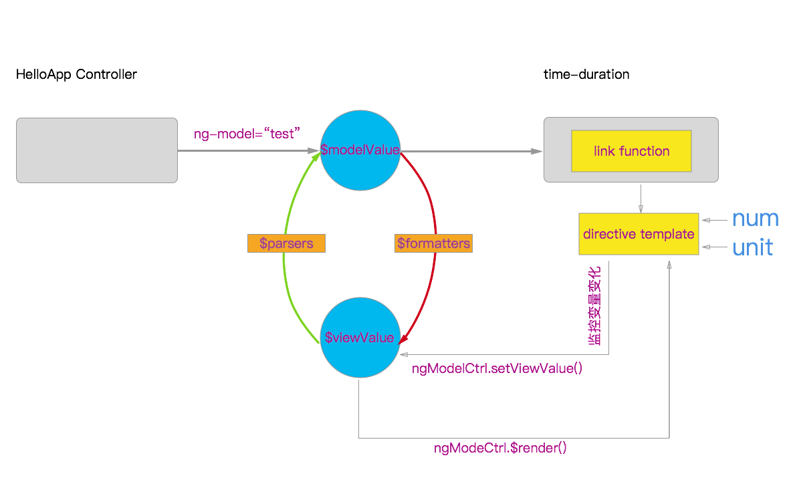

### ngModelController做指令的数据绑定  
在指令中使用ngModel指令模块，需要显式的通过require引入依赖ngModel
```js
require: 'ngModel'
```
对于引入其他的指令，require基本方式有三种:
1. 'ngModel'，表示全局的查找ngModel，如果查找不到则抛出错误。  
2. '^ngModel'(常用)，表示在当前指令的父级指令中查找对应的controller，查找不到则抛出错误。
3. '?ngModel'，表示将require动作变为一个可选项，如果查找不到则不报错。  
4. 以上的修饰词也可以组合使用'?^ngModel'

>通过require依赖的指令，会将此指令的controller注入在link函数的第四个参数上，可以在link函数中操作ngModelController，调用其中的属性以及方法。

这里定义一个指令myDirective实例:
```js
angular
      .module('myApp',[])
      .directive('myDirective', myDirective)
      ;
function myDirective(){
  return {
    restrict: 'EACM',
    replace: true,
    require: '^ngModel',
    link: function(scope, ele, attrs, ngModelCtrl){

    }
  }
}
```

对于ngModelCtrl在连接指令内的模型数据以及视图数据的过程示意图如下:
  
$viewValue就是模板引擎中使用的数据，$modelValue就是在控制器中流通的值，两者的值可以不相同，通过以下的过程可以设置对应的关系。
>对于指令内外绑定数据ngModel的过程主要分为一下几步:  
1. 指令外绑定动态值到ng-model属性上，将值的副本绑定在$modelValue上(ngModelCtrl.$modelValue)，进入指令中。
2. $modelValue通过$formatters依次处理后返回的最后的值会赋值到$viewValue上(ngModelCtrl.$viewValue)，其中$formatters是一个数组，数组中的每一项都是一个处理函数，接受上一个函数的返回值作为唯一的参数，第一个函数的参数就是$modelValue。
```js
ngModelCtrl.$formatters.unshift(function(modelValue){
  //TODO
  return handleValue; //进入下一个处理函数中的唯一参数中，最后值保存在$viewValue中
});
```
3. 通过调用ngModelCtrl.$reander函数将$viewValue中的值变换映射到指令内部的作用域变量中，此时会将绑定在指令内部scope上的值跟新在template模板中，至此完成了 模型数据 到 视图数据 的转化，外部 --》 内部
```js
ngModelCtrl.$reander = function(){
  //获取$viewValue
  ngModelCtrl.$viewValue
  //设置到内部scope上 $viewValue ==> scope
}
```
4. 在指令内部通过事件或者数据监听等方式检测数据的变化，调用ngModelCtrl.$setViewValue(whatYouSet)将新数据设置到$viewValue上
```js
scope.$watch('model', function(){
  ngModelCtrl.$setViewValue(scope.model);
})
```
5. $viewValue通过$parsers依次处理后返回的值会赋值到$modelValue上(ngModelCtrl.$modelValue)，离开指令内部，进入外部的ng-model中，更新外部的视图。其中$parsers是一个数组，数组每一项是处理的函数，函数唯一的参数是上个函数返回值，第一函数的参数是$viewValue值。内部 --》外部
```js
ngModelCtrl.$parsers.unshift(function(viewValue){
  //TODO
  return handelValue; // ==>进入下一个$parsers处理函数中，最后输出保存在 $modelValue
});
```
